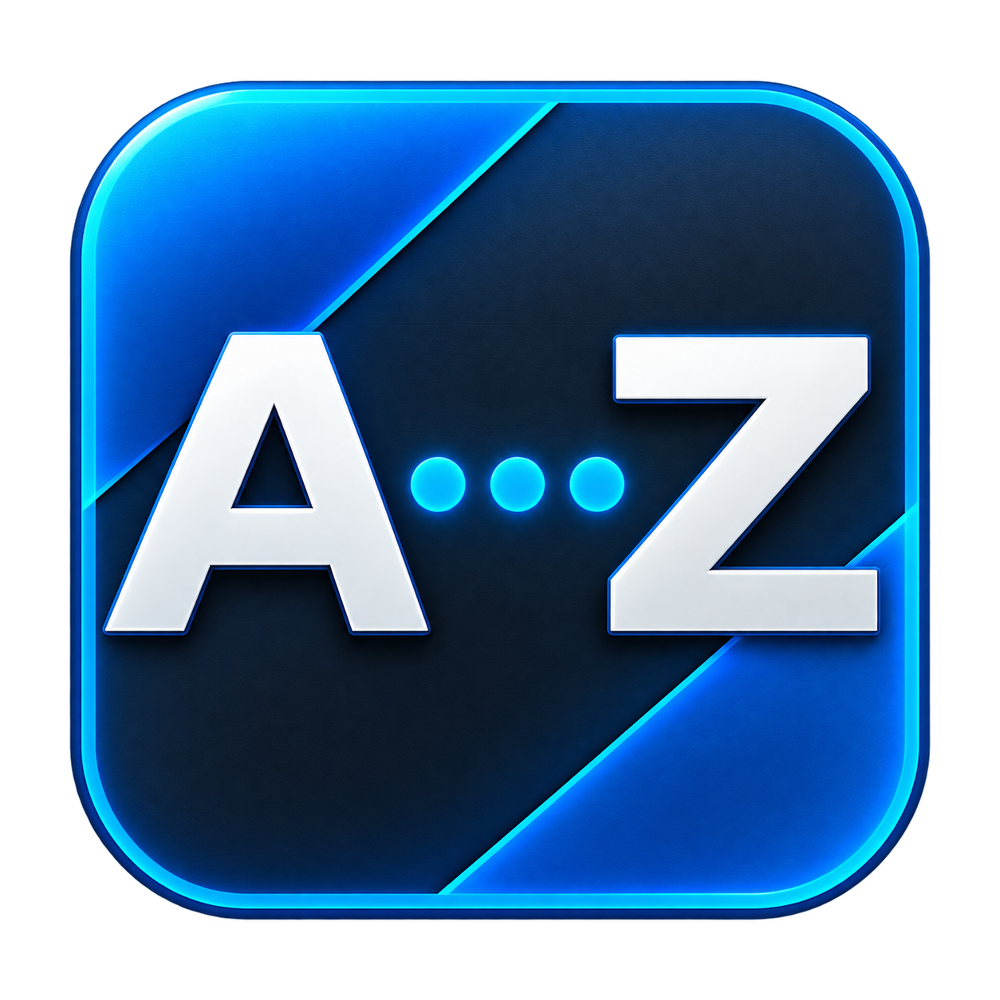

# Aurora A-Z

> Deployment update — 2026-09-05: production is returning to the NetDbg
> loader using build `266e680`, copied as `Aurora\Plugins\NetDbgDll.xex`.
> No launch.ini entry is needed. DashLaunch development and its installer
> are suspended; do not follow the historical DashLaunch instructions below
> or install the current CI DashLaunch payload. Reboot testing of the restored
> NetDbg build is pending. See HANDOFF.md for the verified artifact hash.

<p align="center">
  
</p>

Aurora A-Z is a skin-agnostic, on-coverflow alphabetical selector for the
Aurora dashboard on Xbox 360. The target UI is a transient centered row over a
dimmed coverflow—`ALL # A B ... Z` in Filter mode and `# A B ... Z` in Browse
mode—shown only while R3 is
held, with controller navigation
and selection directly from the main coverflow. It works without modifying or
replacing the selected Aurora skin.

The installed payload is one self-contained file, `AuroraAZ.xex`. All runtime
resources are embedded. Releases also include an optional Aurora Script-menu
installer with browser artwork. Installation does not require QuickViews,
database records, skin files, or changes to `Aurora.xex`. The DashLaunch
installer adds Aurora A-Z to the first empty `launch.ini` plugin slot.
The repository icon is the source artwork for the module identity. It is
embedded in the XEX; installation never copies `icon.png` to the console.

## On-console installation

Copy these three release files into this Aurora Script-menu folder:

```text
Hdd1:\Aurora\User\Scripts\AuroraAZInstaller\Main.lua
Hdd1:\Aurora\User\Scripts\AuroraAZInstaller\AuroraAZ.xex
Hdd1:\Aurora\User\Scripts\AuroraAZInstaller\icon.png
```

It appears as **Install Aurora A-Z** in Aurora's Script menu. The installer
copies the payload to `Hdd1:\Aurora\Plugins\AuroraAZ.xex`, backs up
`Hdd1:\launch.ini` as `launch.ini.AuroraAZ.backup`, and writes the first empty
`plugin1` through `plugin5` entry as
`Hdd:\Aurora\Plugins\AuroraAZ.xex`. It does not overwrite an occupied plugin
slot. Reboot Aurora after it finishes. The installer expects the standard
`Hdd1:\Aurora` location; manual installation remains available for custom
Aurora paths.

### Manual installation

1. Copy `AuroraAZ.xex` to `Hdd1:\Aurora\Plugins\AuroraAZ.xex`.
2. Back up `Hdd1:\launch.ini`.
3. Set the first unused `plugin1` through `plugin5` line under `[Plugins]` to
   `Hdd:\Aurora\Plugins\AuroraAZ.xex`.
4. If an older Aurora A-Z installation occupies
   `Hdd1:\Aurora\Plugins\NetDbgDll.xex`, remove or rename that file so the two
   loader routes cannot run together.
5. Reboot the console.

## Required interaction

The normative controller and filtering behavior is defined in
[`REQUIREMENTS.md`](REQUIREMENTS.md). In short: hold R3 to reveal the
on-coverflow selector; while holding it, D-pad Left/Right and left-stick
Left/Right move the highlight with held-input repeat and end-to-end wrap;
release R3 to apply the selected Browse/Filter
action and hide the row. Aurora
A-Z never consumes A, and RB retains Aurora's normal QuickView menu. A quick
R3 press/release without moving the highlight cancels without filtering.
The next R3 hold reopens on the last selected character.

In Filter mode, `ALL` is scoped: it removes only the alphabetical name filter and preserves
the active QuickView and other filters. On release, the row vanishes and the
selected item grows while fading out; this animation never delays filtering.

## Switching mode

While holding **R3** with the A-Z row open, click **L3** to switch between Browse
and Filter mode. The row updates immediately (`ALL` is present only in Filter
mode) and the choice is saved for future selections. This avoids relying on
Aurora's fixed Configure Modules UI.

`Browse` (the default) jumps to the first matching title in the current
QuickView without rebuilding the list. `Filter` retains the existing behavior
and shows only matching titles. The R3+L3 choice persists under Aurora's Data
directory; the old Configure Modules page is not the supported way to switch
modes in the DashLaunch release.

The architectural constraints that follow from these requirements are recorded
in [`ARCHITECTURE.md`](ARCHITECTURE.md). The gated engineering roadmap is in
[`IMPLEMENTATION_PLAN.md`](IMPLEMENTATION_PLAN.md), and the reviewed Rev1655
Browse/settings ABI is in
[`reference/BROWSE_MODE_REV1655.md`](reference/BROWSE_MODE_REV1655.md).

## Current status

The current deployment route is DashLaunch: commit `45c4b1d`, GitHub Actions
run `33928690065`, with `AuroraAZ.xex` SHA-256
`FE281C349AF43BDBA9039530612A2BD5CF7C1D02722E8D0B439857E949B6B7E8`.
It is installed at `Plugins\AuroraAZ.xex` and loaded through an empty
DashLaunch plugin slot. The former NetDbg bootstrap is historical and must not
remain active alongside this route.

The production hardware baseline has the centered dimmed `ALL # A ... Z`
presentation, enlarged highlight, release animation, alphabetical-only `ALL`
semantics, instant Browse mode, repeated Filter mode, and safe game launching.
The current candidate replaces the freezing system settings popup with an
embedded native module page and refreshes the module row with the repository
`icon.png` artwork.

The hold-R3 filtering interaction now works on hardware, including cancel on
an unmoved R3 tap and completion-based re-arming. Commit `57dd888` is not a
release candidate: an isolated A/B test proved that its still-running worker
blocked normal title handoff. Hardware then disproved ordinal 3 as a launch
notification: the shutdown-capable follow-up still black-screened and its
persisted marker recorded zero shutdown requests. The passing implementation
instead intercepts the exact Rev1655 `ContentLauncher` entry, signals its
worker to restore all four hooks and exit, then immediately resumes Aurora's
original launcher.

### Historical NetDbg research

Offline analysis resolved the static loader contract: Rev1655 constructs
exactly seven hard-coded module wrappers and does not enumerate arbitrary
files under `Plugins`. Its optional Network Debugger wrapper requests the
literal `game:\Plugins\NetDbgDll.xex` path and resolves ordinals 2-5. The
original candidate copied the same bytes under that literal filename. That
research established the bootstrap, but it is no longer the release
installation path. The current release uses DashLaunch and leaves the Network
Debugger slot unused.

The first hardware loader canary was rejected safely in the isolated lab:

```text
Failed to load game:\Plugins\NetDbgDll.xex
Failed to load NetDbgDll
```

The corrected `C51E3A...` retry then established the module-container and
ordinal-resolution path, but its original entry-point observation was
inconclusive. That result is retained as historical evidence, not the current
gate status.

M1 subsequently passed with commit `39b551c`, GitHub Actions run
`33604028771`, and artifact SHA-256
`87894F41A89F4F3CAAFA8A1864AB8F8A91A2ED011882EEEF36E4D3FAEF58596C`.
The FTP round-trip hash matched. That canary validates and calls Aurora
Rev1655's complete thread wrapper at `0x82361AA8`, after validating the
Xapi-thread-startup probe at `0x82804650`. The primary `AZM1` record reported
`source_ordinal=4`, `phase=5` (`COMPLETE`), `state=2` (`RUNNING`), and zero
create/resume statuses; the separate worker record reported `phase=7`
(`WORKER_ENTERED`). Together they prove that Aurora invoked ordinal 4
automatically and that the wrapper entered AuroraAZ-owned worker code. See
[`reference/NETDBG_BOOTSTRAP.md`](reference/NETDBG_BOOTSTRAP.md) and
[`reference/NATIVE_LOADER.md`](reference/NATIVE_LOADER.md).

Functional test r3 is retained only as a hardware research build. It requires a
custom skin and its attempted D-pad Down remap does not work: the coverflow
consumes Down, while RB opens Aurora's separate QuickView menu. That build is
not the requested selector and is not part of the target architecture.

The earlier filter-only v0.1.0 prerelease is deprecated because Aurora
already contains a stock name filter and it does not implement the project
interaction.

The r3/r4 skin builders were deleted on 2026-09-02. They patched `Aurora_Main`
and repurposed the `QuickViewRB` control, which **broke the RB button on
hardware**, and rule 1 of `IMPLEMENTATION_PLAN.md` forbids shipping a patched
skin. Their findings survive in `HANDOFF.md`; the one piece worth keeping is in
`research/`.

## Where to start

Read in this order:

1. [`REQUIREMENTS.md`](REQUIREMENTS.md) — what the selector must do
2. [`ARCHITECTURE.md`](ARCHITECTURE.md) — why it must be a native runtime extension
3. [`HANDOFF.md`](HANDOFF.md) — **verified facts about Aurora**, measured or dumped from
   the console. Read before designing anything; most of it was expensive to learn
4. [`IMPLEMENTATION_PLAN.md`](IMPLEMENTATION_PLAN.md) — the gated roadmap

## Target development workflow

The production implementation must be a version-gated runtime extension for
Aurora 0.7b.2 Rev1655. It will own controller-state handling, render or inject
its own selector overlay above the active skin, and bridge an owned R3 release
to Aurora's coverflow filtering. It must not write to `Skins`. The XEX
toolchain and Network Debugger bootstrap are operational, and M1 is complete.
The hardware-passing M2a artifact is commit `06affc4`, GitHub Actions run
`33736960588`, SHA-256
`431FAD613E1C177B5B5A486B5B21B98AB17BB2AC2592C1A6F630DC07E68EB86E`.
Its final telemetry recorded all seven observed controls, the recovered main caller,
and clean safety fields. The production baseline includes the renderer,
selector, filtering bridge, and nonblocking title-launch cleanup. Visual polish
is tested in the lab first.

## Project layout

```text
REQUIREMENTS.md          Product contract
ARCHITECTURE.md          Architecture decision
IMPLEMENTATION_PLAN.md   Gated roadmap, M0-M7
HANDOFF.md               Verified facts about Aurora, with evidence

scripts/xzp.ps1          XZP extract/build utility
scripts/build-openxechain.sh
                         Native Xbox cross-build entry point
scripts/capture-nova.ps1 Repeatable hardware screenshots through NOVA
native/                  Host-tested core, proven M1/M2a, M3 overlay canary
source/utility/          On-console Lua: QuickView installer, API dump
research/                Rejected skin route, kept as evidence only

original/                Local Aurora binaries and skins; ignored by Git
tools/                   XUIHelper, jeff.exe, Aurora dev docs; ignored by Git
reference/               External research notes
```

Local-only inputs and tools are excluded from Git, so the project never commits
Aurora's binaries or stock skin assets.

Third-party tooling in use: [XUIHelper](https://github.com/SGCSam/XUIHelper) for
XUR/XUI conversion, XboxUnity's `AuroraElements.xml` extension definitions, and
`tools/jeff.exe` for XEX metadata and PowerPC image extraction.

## Safety

Production builds must not modify skin packages or the on-disk `Aurora.xex`.
Any native integration must verify the exact Aurora revision before applying
in-memory hooks and must fail closed on unsupported builds. Database changes
must remain transactional and reversible. Keep FTP access available during
early hardware tests.

Production updates require a verified native CI artifact, a hash check, and a
backup of `Hdd1:\launch.ini` before replacing
`Hdd1:\Aurora\Plugins\AuroraAZ.xex`. Keep the previous XEX until the updated
DashLaunch configuration has been reboot-tested.
