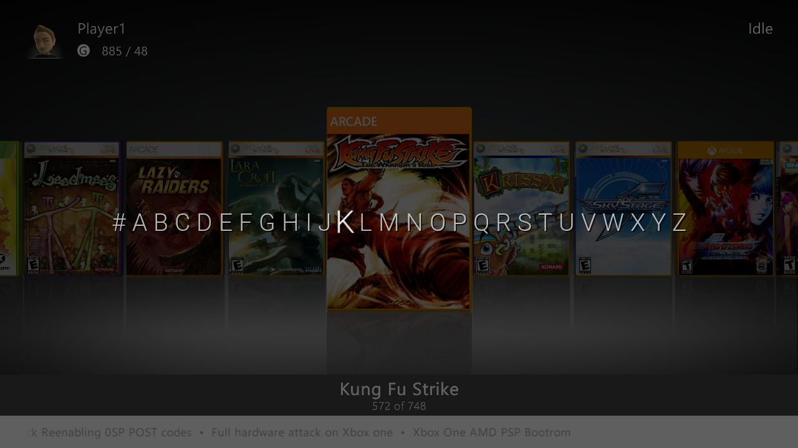

# Aurora A-Z

  

A skin-independent alphabet selector for **Aurora 0.7b.2 Rev1655** on Xbox 360.
Jump through large game libraries or filter by letter—without changing skins.

[Download v1.1](https://github.com/haimbilia/Aurora-A-Z/releases/tag/v1.1)

## Install

1. Download and extract `AuroraAZ-v1.1-Installer.zip`.
2. Copy the `AuroraAZInstaller` folder to
   `Aurora\User\Scripts\Utility\` (keep all three files together).
3. Open Aurora's **Scripts** menu, refresh with **X**, and launch
   **Install Aurora A-Z** under Utility. Choose **Install**.
4. Reboot the console when installation finishes.

The script installs the plugin as `Aurora\Plugins\NetDbgDll.xex`, renaming any
existing file to a backup (with a numbered suffix if needed).
v1.1 detects Aurora's location from the installer folder, including alternate HDD
folders and USB installations; the plugin binary is unchanged from v1.0.
**No launch.ini edits or skin changes.** The Network Debugger and
Aurora A-Z cannot run together. Older DashLaunch installers are unsupported.

Manual alternative: rename the standalone `AuroraAZ.xex` to `NetDbgDll.xex`,
back up any existing file, copy it into Aurora's `Plugins` folder, and reboot.

## Controls

- **Hold R3:** show the alphabet over a dimmed coverflow.
- **D-pad / left stick left or right:** move the highlight; hold to repeat.
  Navigation wraps and remembers the last letter.
- **Release R3:** apply the letter. Without moving, release cancels.
- **While holding R3, click L3:** switch Browse/Filter mode. The saved mode appears
  bottom-right for five seconds; switching again restarts the timer.

**Browse** jumps to the first matching title in the current QuickView without
rebuilding the list. **Filter** shows matching titles; large libraries can take
longer. `ALL` appears only in Filter mode and clears only the alphabetical filter,
preserving your QuickView. A and RB keep their normal Aurora functions.

## Compatibility & removal

Requires a homebrew-capable Xbox 360 and the exact Aurora revision above.
Module settings radio UI and the module icon remain unfinished; use R3+L3.
To uninstall, remove this plugin's `NetDbgDll.xex`, restore any original debugger
file you backed up, and reboot. Skins and `Aurora.xex` are untouched.

## Build

Host tests: `cmake -S native -B build/host`, then `cmake --build build/host`
and `ctest --test-dir build/host`. Xbox builds use the **Native runtime** GitHub
workflow or `scripts/build-openxechain.sh` with OpenXeChain installed.

Release notes and downloads are on [GitHub Releases](https://github.com/haimbilia/Aurora-A-Z/releases).
